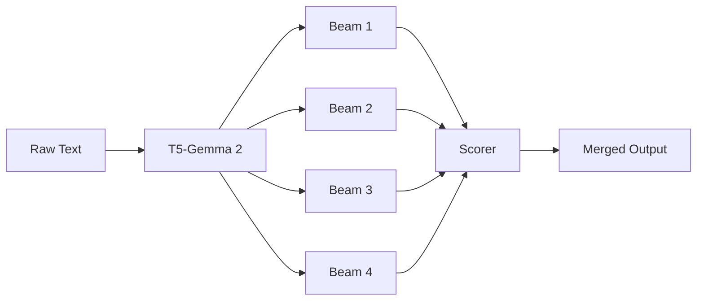

## Core Concepts

<a id="core-concepts"></a>

This section covers the fundamental concepts behind the corp-extractor library and how it transforms unstructured text into structured knowledge.

### Statement Extraction

<a id="statement-extraction"></a>

Statement extraction is the process of converting unstructured natural language text into structured **subject-predicate-object triples**. Each triple represents a discrete fact or relationship extracted from the source text.

For example, given the text:

> "Apple announced a new iPhone at their Cupertino headquarters."

The extractor produces triples like:

<table>
  <thead>
    <tr>
      <th>Subject</th>
      <th>Predicate</th>
      <th>Object</th>
    </tr>
  </thead>
  <tbody>
    <tr>
      <td>Apple (ORG)</td>
      <td>announced</td>
      <td>iPhone (PRODUCT)</td>
    </tr>
    <tr>
      <td>Apple (ORG)</td>
      <td>has headquarters in</td>
      <td>Cupertino (GPE)</td>
    </tr>
  </tbody>
</table>

#### The T5-Gemma 2 Model

Corp-extractor uses a fine-tuned **T5-Gemma 2 model** with 540 million parameters. This encoder-decoder architecture excels at sequence-to-sequence tasks, making it well-suited for transforming text into structured XML output.

The model processes input text wrapped in `<page>` tags and generates XML containing `<stmt>` elements with subject, predicate, object, and source text spans.

#### Entity Type Recognition

Each extracted subject and object is classified into one of **12 entity types** (plus UNKNOWN):

<table>
  <thead>
    <tr>
      <th>Type</th>
      <th>Description</th>
      <th>Example</th>
    </tr>
  </thead>
  <tbody>
    <tr>
      <td><code>ORG</code></td>
      <td>Organizations, companies</td>
      <td>Apple, United Nations</td>
    </tr>
    <tr>
      <td><code>PERSON</code></td>
      <td>Named individuals</td>
      <td>Tim Cook, Marie Curie</td>
    </tr>
    <tr>
      <td><code>GPE</code></td>
      <td>Geopolitical entities</td>
      <td>France, New York City</td>
    </tr>
    <tr>
      <td><code>LOC</code></td>
      <td>Non-GPE locations</td>
      <td>Mount Everest, Pacific Ocean</td>
    </tr>
    <tr>
      <td><code>PRODUCT</code></td>
      <td>Products, artifacts</td>
      <td>iPhone, Model S</td>
    </tr>
    <tr>
      <td><code>EVENT</code></td>
      <td>Named events</td>
      <td>World War II, Olympics</td>
    </tr>
    <tr>
      <td><code>WORK_OF_ART</code></td>
      <td>Creative works</td>
      <td>Mona Lisa, Hamlet</td>
    </tr>
    <tr>
      <td><code>LAW</code></td>
      <td>Legal documents</td>
      <td>GDPR, First Amendment</td>
    </tr>
    <tr>
      <td><code>DATE</code></td>
      <td>Temporal expressions</td>
      <td>January 2024, last Tuesday</td>
    </tr>
    <tr>
      <td><code>MONEY</code></td>
      <td>Monetary values</td>
      <td>$50 million, €100</td>
    </tr>
    <tr>
      <td><code>PERCENT</code></td>
      <td>Percentages</td>
      <td>15%, half</td>
    </tr>
    <tr>
      <td><code>QUANTITY</code></td>
      <td>Measurements</td>
      <td>500 kilometers, 3 tons</td>
    </tr>
    <tr>
      <td><code>UNKNOWN</code></td>
      <td>Unclassified entities</td>
      <td>—</td>
    </tr>
  </tbody>
</table>

---

### Diverse Beam Search

<a id="diverse-beam-search"></a>

Corp-extractor uses **Diverse Beam Search** ([Vijayakumar et al., 2016](https://arxiv.org/abs/1610.02424)) to generate multiple candidate extractions from the same input text.

#### Why Diverse Beam Search?

Standard beam search tends to produce similar outputs—slight variations of the same interpretation. Diverse Beam Search introduces a **diversity penalty** that encourages the model to explore fundamentally different extractions.

This is particularly valuable for statement extraction because:

- A single sentence may contain multiple valid interpretations
- Different phrasings can capture different aspects of the same fact
- Merging diverse outputs produces more comprehensive coverage

#### How It Works



The model generates multiple beams in parallel, each representing a different extraction path. A diversity penalty is applied during generation to prevent beams from converging on identical outputs.

#### Default Parameters

<table>
  <thead>
    <tr>
      <th>Parameter</th>
      <th>Default</th>
      <th>Description</th>
    </tr>
  </thead>
  <tbody>
    <tr>
      <td><code>num_beams</code></td>
      <td>4</td>
      <td>Number of parallel beams to generate</td>
    </tr>
    <tr>
      <td><code>diversity_penalty</code></td>
      <td>1.0</td>
      <td>Strength of diversity encouragement (higher = more diverse)</td>
    </tr>
  </tbody>
</table>

```python
from statement_extractor import extract_statements

# Use default beam search settings
result = extract_statements("Apple announced a new iPhone.")

# Customize beam search
result = extract_statements(
    "Apple announced a new iPhone.",
    num_beams=6,
    diversity_penalty=1.5
)
```

---

### Quality Scoring

<a id="quality-scoring"></a>

<span className="text-xs font-medium bg-blue-100 dark:bg-blue-900 text-blue-800 dark:text-blue-200 px-2 py-0.5 rounded">NEW in v0.2.0</span>

Version 0.2.0 introduces **groundedness scoring**—a quality assessment system that measures how well each extracted triple is supported by the source text.

#### Groundedness Score

Each statement receives a **groundedness score** between 0 and 1, calculated from four components:

<table>
  <thead>
    <tr>
      <th>Check</th>
      <th>Weight</th>
      <th>Description</th>
    </tr>
  </thead>
  <tbody>
    <tr>
      <td>Subject in source</td>
      <td>0.3</td>
      <td>Is the subject text found in the original input?</td>
    </tr>
    <tr>
      <td>Object in source</td>
      <td>0.3</td>
      <td>Is the object text found in the original input?</td>
    </tr>
    <tr>
      <td>Predicate trigger</td>
      <td>0.2</td>
      <td>Does the source contain words that trigger this predicate?</td>
    </tr>
    <tr>
      <td>Proximity</td>
      <td>0.2</td>
      <td>Are the subject and object mentioned close together?</td>
    </tr>
  </tbody>
</table>

A score of **1.0** indicates the triple is fully grounded in the source text. Lower scores suggest the model may have hallucinated or inferred information not explicitly stated.

#### Confidence Filtering

Use the `min_confidence` parameter to filter out low-quality extractions:

```python
from statement_extractor import extract_statements

# Only return statements with groundedness >= 0.7
result = extract_statements(
    "Apple CEO Tim Cook announced the iPhone 15.",
    min_confidence=0.7
)

# Access individual scores
for stmt in result:
    print(f"{stmt.subject.text} -> {stmt.predicate} -> {stmt.object.text}")
    print(f"  Groundedness: {stmt.groundedness:.2f}")
```

#### Beam Merging vs Best Beam Selection

Corp-extractor supports two strategies for combining beam outputs:

<table>
  <thead>
    <tr>
      <th>Strategy</th>
      <th>Description</th>
      <th>Use Case</th>
    </tr>
  </thead>
  <tbody>
    <tr>
      <td><code>merge</code> (default)</td>
      <td>Combine unique statements from all beams, deduplicated by content</td>
      <td>Maximum coverage</td>
    </tr>
    <tr>
      <td><code>best</code></td>
      <td>Return only statements from the highest-scoring beam</td>
      <td>Higher precision</td>
    </tr>
  </tbody>
</table>

```python
# Merge all beams (default)
result = extract_statements(text, beam_strategy="merge")

# Use only the best beam
result = extract_statements(text, beam_strategy="best")
```

When using `merge`, statements are deduplicated based on normalized subject-predicate-object content, and the highest groundedness score is retained for duplicates.

---

### GLiNER2 Integration

<a id="gliner2-integration"></a>

<span className="text-xs font-medium bg-green-100 dark:bg-green-900 text-green-800 dark:text-green-200 px-2 py-0.5 rounded">NEW in v0.4.0</span>

Version 0.4.0 introduces **GLiNER2** (205M parameters) for entity recognition and relation extraction, replacing spaCy.

#### Why GLiNER2?

GLiNER2 is a unified model that handles:
- **Named Entity Recognition** - identifying entities with types
- **Relation Extraction** - using 324 default predicates across 21 categories
- **Confidence Scoring** - real confidence values via `include_confidence=True`
- **Entity Scoring** - measuring how "entity-like" subjects and objects are

#### Default Predicates

GLiNER2 uses **324 predicates** organized into 21 categories loaded from `default_predicates.json`. Categories include:

- **ownership_control** - acquires, owns, has_subsidiary, etc.
- **employment_leadership** - employs, is_ceo_of, manages, etc.
- **funding_investment** - funds, invests_in, sponsors, etc.
- **supply_chain** - supplies, manufactures, distributes_for, etc.
- **legal_regulatory** - regulates, violates, complies_with, etc.

Each predicate includes a description for semantic matching and a confidence threshold.

#### All Matches Returned

GLiNER2 now returns **all matching relations**, not just the best one. This allows downstream filtering and selection based on your use case:

```python
from statement_extractor.pipeline import ExtractionPipeline

pipeline = ExtractionPipeline()
ctx = pipeline.process("Amazon CEO Andy Jassy announced plans to hire workers.")

# All matching relations are returned, sorted by confidence
for stmt in ctx.statements:
    print(f"{stmt.subject.text} --[{stmt.predicate}]--> {stmt.object.text}")
    print(f"  Category: {stmt.predicate_category}")
    print(f"  Confidence: {stmt.confidence_score:.2f}")
```

#### Custom Predicates

You can provide custom predicates via a JSON file:

```python
from statement_extractor.pipeline import ExtractionPipeline, PipelineConfig

config = PipelineConfig(
    extractor_options={"predicates_file": "/path/to/custom_predicates.json"}
)
pipeline = ExtractionPipeline(config)
```

Or via CLI:
```bash
corp-extractor pipeline "..." --predicates-file custom_predicates.json
```

#### Entity-Based Scoring

Confidence scores come directly from GLiNER2 with `include_confidence=True`:

<table>
  <thead>
    <tr>
      <th>Source</th>
      <th>Description</th>
    </tr>
  </thead>
  <tbody>
    <tr>
      <td>Relation confidence</td>
      <td>GLiNER2 confidence in the relation match</td>
    </tr>
    <tr>
      <td>Entity confidence</td>
      <td>GLiNER2 confidence in entity recognition</td>
    </tr>
  </tbody>
</table>

---

### Pipeline Architecture

<a id="pipeline-architecture"></a>

<span className="text-xs font-medium bg-green-100 dark:bg-green-900 text-green-800 dark:text-green-200 px-2 py-0.5 rounded">Updated in v0.8.0</span>

Version 0.8.0 uses a **5-stage plugin-based pipeline** for comprehensive entity resolution, statement enrichment, and taxonomy classification. Qualification and canonicalization have been merged into a single stage using the embedding database.

#### The 5 Stages


<table>
  <thead>
    <tr>
      <th>Stage</th>
      <th>Name</th>
      <th>Input</th>
      <th>Output</th>
      <th>Purpose</th>
    </tr>
  </thead>
  <tbody>
    <tr>
      <td>1</td>
      <td>Splitting</td>
      <td>Text</td>
      <td><code>RawTriple[]</code></td>
      <td>Extract raw subject-predicate-object triples using T5-Gemma2</td>
    </tr>
    <tr>
      <td>2</td>
      <td>Extraction</td>
      <td><code>RawTriple[]</code></td>
      <td><code>PipelineStatement[]</code></td>
      <td>Refine entities with type recognition using GLiNER2</td>
    </tr>
    <tr>
      <td>3</td>
      <td>Entity Qualification</td>
      <td>Entities</td>
      <td><code>CanonicalEntity[]</code></td>
      <td>Add identifiers (LEI, CIK, etc.) and resolve canonical names via embedding database</td>
    </tr>
    <tr>
      <td>4</td>
      <td>Labeling</td>
      <td>Statements</td>
      <td><code>LabeledStatement[]</code></td>
      <td>Apply sentiment, relation type, confidence labels</td>
    </tr>
    <tr>
      <td>5</td>
      <td>Taxonomy</td>
      <td>Statements</td>
      <td><code>TaxonomyResult[]</code></td>
      <td>Classify against large taxonomies (ESG topics, etc.)</td>
    </tr>
  </tbody>
</table>

#### Stage 1: Splitting

The splitting stage transforms raw text into `RawTriple` objects using the T5-Gemma2 model. Each triple contains:

- **subject_text**: The raw subject text
- **predicate_text**: The raw predicate/relationship
- **object_text**: The raw object text
- **source_sentence**: The sentence this triple was extracted from
- **confidence**: Extraction confidence score

#### Stage 2: Extraction

The extraction stage uses GLiNER2 to extract relations and assign entity types, producing `PipelineStatement` objects with:

- **subject**: `ExtractedEntity` with text, type, span, and confidence
- **object**: `ExtractedEntity` with text, type, span, and confidence
- **predicate**: Predicate from GLiNER2's 324 default predicates
- **predicate_category**: Category the predicate belongs to (e.g., "employment_leadership")
- **source_text**: Source text for this statement
- **confidence_score**: Real confidence from GLiNER2

**Note:** Stage 2 returns **all matching relations** from GLiNER2, not just the best one. This allows downstream stages to filter, deduplicate, or select based on specific criteria. Relations are sorted by confidence (descending).

#### Stage 3: Entity Qualification

Entity qualification combines what were previously separate qualification and canonicalization stages. It adds context, external identifiers, and canonical names to entities using the embedding database:

- **PersonQualifier**: Adds role, organization, and canonical ID for PERSON entities <span className="text-xs font-medium bg-green-100 dark:bg-green-900 text-green-800 dark:text-green-200 px-2 py-0.5 rounded">Enhanced in v0.9.0</span>
  - Uses LLM (Gemma3) to extract role and organization from context
  - Searches person database for notable people (executives, politicians, athletes, etc.)
  - Resolves organization mentions against the organization database
  - Returns canonical Wikidata IDs for matched people
- **EmbeddingCompanyQualifier**: Looks up company identifiers (LEI, CIK, UK company numbers) and canonical names using vector similarity search

The output is `CanonicalEntity` with:
- **entity_type**: Classification (business, nonprofit, government, etc.)
- **canonical_match**: Match details (id, name, method, confidence)
- **fqn**: Fully Qualified Name, e.g., "Tim Cook (CEO, Apple Inc)"
- External identifiers: `lei`, `ch_number`, `sec_cik`, `ticker`, etc.
- **resolved_role**: Canonical role information from person database <span className="text-xs font-medium bg-green-100 dark:bg-green-900 text-green-800 dark:text-green-200 px-2 py-0.5 rounded">v0.9.0</span>
- **resolved_org**: Canonical organization information from org database <span className="text-xs font-medium bg-green-100 dark:bg-green-900 text-green-800 dark:text-green-200 px-2 py-0.5 rounded">v0.9.0</span>

**Note:** The embedding-based company qualifier replaces the older API-based qualifiers (GLEIF, Companies House, SEC Edgar APIs) for faster, offline entity resolution.

#### Stage 4: Labeling

Labeling plugins annotate statements with additional metadata:

- **SentimentLabeler**: Adds sentiment classification (positive/negative/neutral)
- **ConfidenceLabeler**: Adds confidence scoring
- **RelationTypeLabeler**: Classifies relation types

The output is `LabeledStatement` with:
- Original statement
- Canonicalized subject and object
- List of `StatementLabel` objects

#### Stage 5: Taxonomy

Taxonomy classification plugins classify statements against large taxonomies with hundreds of possible values. **Multiple labels may match a single statement** above the confidence threshold.

- **MNLITaxonomyClassifier**: Uses MNLI zero-shot classification for accurate taxonomy labeling
- **EmbeddingTaxonomyClassifier**: Uses embedding similarity for faster classification

The output is a **list of `TaxonomyResult`** objects, each with:
- **taxonomy_name**: Name of the taxonomy (e.g., "esg_topics")
- **category**: Top-level category (e.g., "environment", "governance")
- **label**: Specific label within the category
- **confidence**: Classification confidence score

Both classifiers use **hierarchical classification** for efficiency: first identify the top-k categories, then return all labels above the threshold within those categories.

#### Plugin System

Each stage is implemented through plugins registered with `PluginRegistry`. Plugins can be:

- **Enabled/disabled** per invocation
- **Prioritized** for execution order
- **Entity-type specific** (e.g., PersonQualifier only runs on PERSON entities)

```python
from statement_extractor.pipeline import PipelineConfig, ExtractionPipeline

# Run with specific plugins disabled
config = PipelineConfig(
    disabled_plugins={"mnli_taxonomy_classifier"}  # Use embedding classifier instead
)
pipeline = ExtractionPipeline(config)
ctx = pipeline.process(text)
```

---

### Document Processing

<a id="document-processing"></a>

<span className="text-xs font-medium bg-green-100 dark:bg-green-900 text-green-800 dark:text-green-200 px-2 py-0.5 rounded">NEW in v0.7.0</span>

Version 0.7.0 introduces **document-level processing** for handling files, URLs, and PDFs with automatic chunking, deduplication, and citation tracking.

#### Document Pipeline


The document pipeline:
1. **Loads** content from files, URLs, or PDFs
2. **Chunks** text into optimal-sized segments for the extraction model
3. **Processes** each chunk through the 5-stage extraction pipeline
4. **Deduplicates** statements across chunks
5. **Generates** optional document summary
6. **Tracks** citations back to source chunks

#### Chunking Strategy

Documents are split into chunks based on token count with configurable overlap:

<table>
  <thead>
    <tr>
      <th>Parameter</th>
      <th>Default</th>
      <th>Description</th>
    </tr>
  </thead>
  <tbody>
    <tr>
      <td><code>target_tokens</code></td>
      <td>1000</td>
      <td>Target tokens per chunk</td>
    </tr>
    <tr>
      <td><code>overlap_tokens</code></td>
      <td>100</td>
      <td>Token overlap between consecutive chunks</td>
    </tr>
    <tr>
      <td><code>respect_sentences</code></td>
      <td>true</td>
      <td>Avoid splitting mid-sentence</td>
    </tr>
  </tbody>
</table>

#### URL and PDF Support

The document pipeline can fetch and process content from URLs:

- **Web pages**: HTML content is extracted using Readability-style parsing
- **PDFs**: Parsed using PyMuPDF with optional OCR for scanned documents

```python
from statement_extractor.document import DocumentPipeline

pipeline = DocumentPipeline()

# Process a web page
ctx = await pipeline.process_url("https://example.com/article")

# Process a PDF with OCR
from statement_extractor.document import URLLoaderConfig
config = URLLoaderConfig(use_ocr=True)
ctx = await pipeline.process_url("https://example.com/report.pdf", config)
```

#### Cross-Chunk Deduplication

When processing long documents, the same fact may appear in multiple chunks. The deduplicator uses embedding similarity to identify and merge duplicate statements, keeping the highest-confidence version with proper citation tracking.

---

### Entity Embedding Database

<a id="entity-database"></a>

<span className="text-xs font-medium bg-green-100 dark:bg-green-900 text-green-800 dark:text-green-200 px-2 py-0.5 rounded">UPDATED in v0.9.0</span>

The entity embedding database provides fast qualification for both **organizations** and **people** using vector similarity search.

#### Organization Data Sources

<table>
  <thead>
    <tr>
      <th>Source</th>
      <th>Records</th>
      <th>Identifier</th>
      <th>EntityType Mapping</th>
    </tr>
  </thead>
  <tbody>
    <tr>
      <td>GLEIF</td>
      <td>~3.2M</td>
      <td>LEI (Legal Entity Identifier)</td>
      <td>GENERAL→business, FUND→fund, BRANCH→branch</td>
    </tr>
    <tr>
      <td>SEC Edgar</td>
      <td>~100K+</td>
      <td>CIK (Central Index Key)</td>
      <td>business (or fund via SIC codes)</td>
    </tr>
    <tr>
      <td>Companies House</td>
      <td>~5M</td>
      <td>UK Company Number</td>
      <td>Maps company_type to business/nonprofit</td>
    </tr>
    <tr>
      <td>Wikidata</td>
      <td>Variable</td>
      <td>QID</td>
      <td>35+ query types mapped to EntityType</td>
    </tr>
  </tbody>
</table>

#### Person Data Sources <span className="text-xs font-medium bg-green-100 dark:bg-green-900 text-green-800 dark:text-green-200 px-2 py-0.5 rounded">NEW in v0.9.0</span>

<table>
  <thead>
    <tr>
      <th>PersonType</th>
      <th>Description</th>
      <th>Example People</th>
    </tr>
  </thead>
  <tbody>
    <tr>
      <td><code>executive</code></td>
      <td>C-suite, board members</td>
      <td>Tim Cook, Satya Nadella</td>
    </tr>
    <tr>
      <td><code>politician</code></td>
      <td>Elected officials, diplomats</td>
      <td>Joe Biden, Angela Merkel</td>
    </tr>
    <tr>
      <td><code>athlete</code></td>
      <td>Sports figures</td>
      <td>LeBron James, Lionel Messi</td>
    </tr>
    <tr>
      <td><code>artist</code></td>
      <td>Actors, musicians, directors</td>
      <td>Tom Hanks, Taylor Swift</td>
    </tr>
    <tr>
      <td><code>academic</code></td>
      <td>Professors, researchers</td>
      <td>Neil deGrasse Tyson</td>
    </tr>
    <tr>
      <td><code>scientist</code></td>
      <td>Scientists, inventors</td>
      <td>Researchers, lab directors</td>
    </tr>
    <tr>
      <td><code>journalist</code></td>
      <td>Media personalities</td>
      <td>Anderson Cooper</td>
    </tr>
    <tr>
      <td><code>entrepreneur</code></td>
      <td>Founders, business owners</td>
      <td>Mark Zuckerberg</td>
    </tr>
    <tr>
      <td><code>activist</code></td>
      <td>Advocates, campaigners</td>
      <td>Greta Thunberg</td>
    </tr>
  </tbody>
</table>

People are imported from **Wikidata** with English Wikipedia articles (ensuring notability). Each person record includes:
- **name**: Display name
- **known_for_role**: Primary role (e.g., "CEO", "President")
- **known_for_org**: Primary organization (e.g., "Apple Inc", "Tesla")
- **country**: Country of citizenship
- **person_type**: Classification category

#### EntityType Classification

<span className="text-xs font-medium bg-green-100 dark:bg-green-900 text-green-800 dark:text-green-200 px-2 py-0.5 rounded">NEW in v0.8.0</span>

Each organization record is classified with an `entity_type` field to distinguish between businesses, non-profits, government agencies, and other organization types:

<table>
  <thead>
    <tr>
      <th>Category</th>
      <th>Types</th>
      <th>Description</th>
    </tr>
  </thead>
  <tbody>
    <tr>
      <td>Business</td>
      <td><code>business</code>, <code>fund</code>, <code>branch</code></td>
      <td>Commercial entities, investment funds, branch offices</td>
    </tr>
    <tr>
      <td>Non-profit</td>
      <td><code>nonprofit</code>, <code>ngo</code>, <code>foundation</code>, <code>trade_union</code></td>
      <td>Charitable organizations, NGOs, labor unions</td>
    </tr>
    <tr>
      <td>Government</td>
      <td><code>government</code>, <code>international_org</code>, <code>political_party</code></td>
      <td>Government agencies, UN/WHO/IMF, political parties</td>
    </tr>
    <tr>
      <td>Education</td>
      <td><code>educational</code>, <code>research</code></td>
      <td>Schools, universities, research institutes</td>
    </tr>
    <tr>
      <td>Other</td>
      <td><code>healthcare</code>, <code>media</code>, <code>sports</code>, <code>religious</code></td>
      <td>Hospitals, studios, sports clubs, religious orgs</td>
    </tr>
    <tr>
      <td>Unknown</td>
      <td><code>unknown</code></td>
      <td>Classification not determined</td>
    </tr>
  </tbody>
</table>

#### How It Works

1. **Embedding Generation**: Organization names are embedded using EmbeddingGemma (300M params)
2. **Vector Search**: sqlite-vec enables fast similarity search across millions of records
3. **Qualification**: When an ORG entity is found, the database is searched for matching organizations
4. **Identifier Resolution**: Matched organizations provide LEI, CIK, company numbers, etc.

#### Database Variants

- **entities-lite.db**: Core fields and embeddings only (default download, smaller)
- **entities.db**: Full database with complete source metadata
- **\*.db.gz**: Gzip compressed versions for faster downloads
