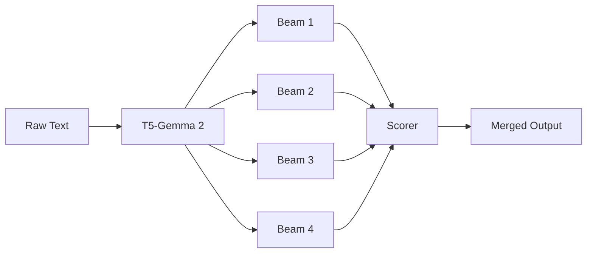

## Core Concepts

<a id="core-concepts"></a>

This section covers the fundamental concepts behind the corp-extractor library and how it transforms unstructured text into structured knowledge.

### Statement Extraction

<a id="statement-extraction"></a>

Statement extraction is the process of converting unstructured natural language text into structured **subject-predicate-object triples**. Each triple represents a discrete fact or relationship extracted from the source text.

For example, given the text:

> "Apple announced a new iPhone at their Cupertino headquarters."

The extractor produces triples like:

<table>
  <thead>
    <tr>
      <th>Subject</th>
      <th>Predicate</th>
      <th>Object</th>
    </tr>
  </thead>
  <tbody>
    <tr>
      <td>Apple (ORG)</td>
      <td>announced</td>
      <td>iPhone (PRODUCT)</td>
    </tr>
    <tr>
      <td>Apple (ORG)</td>
      <td>has headquarters in</td>
      <td>Cupertino (GPE)</td>
    </tr>
  </tbody>
</table>

#### The T5-Gemma 2 Model

Corp-extractor uses a fine-tuned **T5-Gemma 2 model** with 540 million parameters. This encoder-decoder architecture excels at sequence-to-sequence tasks, making it well-suited for transforming text into structured XML output.

The model processes input text wrapped in `<page>` tags and generates XML containing `<stmt>` elements with subject, predicate, object, and source text spans.

#### Entity Type Recognition

Each extracted subject and object is classified into one of **12 entity types** (plus UNKNOWN):

<table>
  <thead>
    <tr>
      <th>Type</th>
      <th>Description</th>
      <th>Example</th>
    </tr>
  </thead>
  <tbody>
    <tr>
      <td><code>ORG</code></td>
      <td>Organizations, companies</td>
      <td>Apple, United Nations</td>
    </tr>
    <tr>
      <td><code>PERSON</code></td>
      <td>Named individuals</td>
      <td>Tim Cook, Marie Curie</td>
    </tr>
    <tr>
      <td><code>GPE</code></td>
      <td>Geopolitical entities</td>
      <td>France, New York City</td>
    </tr>
    <tr>
      <td><code>LOC</code></td>
      <td>Non-GPE locations</td>
      <td>Mount Everest, Pacific Ocean</td>
    </tr>
    <tr>
      <td><code>PRODUCT</code></td>
      <td>Products, artifacts</td>
      <td>iPhone, Model S</td>
    </tr>
    <tr>
      <td><code>EVENT</code></td>
      <td>Named events</td>
      <td>World War II, Olympics</td>
    </tr>
    <tr>
      <td><code>WORK_OF_ART</code></td>
      <td>Creative works</td>
      <td>Mona Lisa, Hamlet</td>
    </tr>
    <tr>
      <td><code>LAW</code></td>
      <td>Legal documents</td>
      <td>GDPR, First Amendment</td>
    </tr>
    <tr>
      <td><code>DATE</code></td>
      <td>Temporal expressions</td>
      <td>January 2024, last Tuesday</td>
    </tr>
    <tr>
      <td><code>MONEY</code></td>
      <td>Monetary values</td>
      <td>$50 million, €100</td>
    </tr>
    <tr>
      <td><code>PERCENT</code></td>
      <td>Percentages</td>
      <td>15%, half</td>
    </tr>
    <tr>
      <td><code>QUANTITY</code></td>
      <td>Measurements</td>
      <td>500 kilometers, 3 tons</td>
    </tr>
    <tr>
      <td><code>UNKNOWN</code></td>
      <td>Unclassified entities</td>
      <td>—</td>
    </tr>
  </tbody>
</table>

---

### Diverse Beam Search

<a id="diverse-beam-search"></a>

Corp-extractor uses **Diverse Beam Search** ([Vijayakumar et al., 2016](https://arxiv.org/abs/1610.02424)) to generate multiple candidate extractions from the same input text.

#### Why Diverse Beam Search?

Standard beam search tends to produce similar outputs—slight variations of the same interpretation. Diverse Beam Search introduces a **diversity penalty** that encourages the model to explore fundamentally different extractions.

This is particularly valuable for statement extraction because:

- A single sentence may contain multiple valid interpretations
- Different phrasings can capture different aspects of the same fact
- Merging diverse outputs produces more comprehensive coverage

#### How It Works



The model generates multiple beams in parallel, each representing a different extraction path. A diversity penalty is applied during generation to prevent beams from converging on identical outputs.

#### Default Parameters

<table>
  <thead>
    <tr>
      <th>Parameter</th>
      <th>Default</th>
      <th>Description</th>
    </tr>
  </thead>
  <tbody>
    <tr>
      <td><code>num_beams</code></td>
      <td>4</td>
      <td>Number of parallel beams to generate</td>
    </tr>
    <tr>
      <td><code>diversity_penalty</code></td>
      <td>1.0</td>
      <td>Strength of diversity encouragement (higher = more diverse)</td>
    </tr>
  </tbody>
</table>

```python
from statement_extractor import extract_statements

# Use default beam search settings
result = extract_statements("Apple announced a new iPhone.")

# Customize beam search
result = extract_statements(
    "Apple announced a new iPhone.",
    num_beams=6,
    diversity_penalty=1.5
)
```

---

### Quality Scoring

<a id="quality-scoring"></a>

<span className="text-xs font-medium bg-blue-100 dark:bg-blue-900 text-blue-800 dark:text-blue-200 px-2 py-0.5 rounded">NEW in v0.2.0</span>

Version 0.2.0 introduces **groundedness scoring**—a quality assessment system that measures how well each extracted triple is supported by the source text.

#### Groundedness Score

Each statement receives a **groundedness score** between 0 and 1, calculated from four components:

<table>
  <thead>
    <tr>
      <th>Check</th>
      <th>Weight</th>
      <th>Description</th>
    </tr>
  </thead>
  <tbody>
    <tr>
      <td>Subject in source</td>
      <td>0.3</td>
      <td>Is the subject text found in the original input?</td>
    </tr>
    <tr>
      <td>Object in source</td>
      <td>0.3</td>
      <td>Is the object text found in the original input?</td>
    </tr>
    <tr>
      <td>Predicate trigger</td>
      <td>0.2</td>
      <td>Does the source contain words that trigger this predicate?</td>
    </tr>
    <tr>
      <td>Proximity</td>
      <td>0.2</td>
      <td>Are the subject and object mentioned close together?</td>
    </tr>
  </tbody>
</table>

A score of **1.0** indicates the triple is fully grounded in the source text. Lower scores suggest the model may have hallucinated or inferred information not explicitly stated.

#### Confidence Filtering

Use the `min_confidence` parameter to filter out low-quality extractions:

```python
from statement_extractor import extract_statements

# Only return statements with groundedness >= 0.7
result = extract_statements(
    "Apple CEO Tim Cook announced the iPhone 15.",
    min_confidence=0.7
)

# Access individual scores
for stmt in result:
    print(f"{stmt.subject.text} -> {stmt.predicate} -> {stmt.object.text}")
    print(f"  Groundedness: {stmt.groundedness:.2f}")
```

#### Beam Merging vs Best Beam Selection

Corp-extractor supports two strategies for combining beam outputs:

<table>
  <thead>
    <tr>
      <th>Strategy</th>
      <th>Description</th>
      <th>Use Case</th>
    </tr>
  </thead>
  <tbody>
    <tr>
      <td><code>merge</code> (default)</td>
      <td>Combine unique statements from all beams, deduplicated by content</td>
      <td>Maximum coverage</td>
    </tr>
    <tr>
      <td><code>best</code></td>
      <td>Return only statements from the highest-scoring beam</td>
      <td>Higher precision</td>
    </tr>
  </tbody>
</table>

```python
# Merge all beams (default)
result = extract_statements(text, beam_strategy="merge")

# Use only the best beam
result = extract_statements(text, beam_strategy="best")
```

When using `merge`, statements are deduplicated based on normalized subject-predicate-object content, and the highest groundedness score is retained for duplicates.
